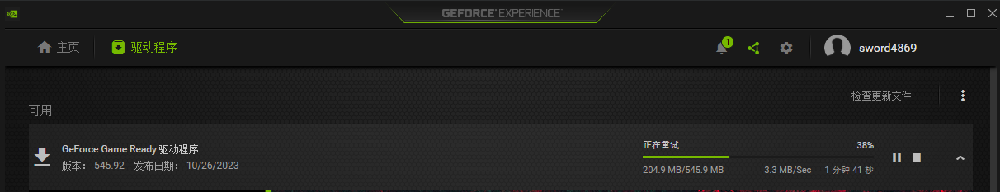
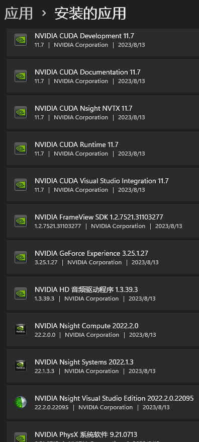

- [1. summary](#1-summary)
- [2. 准备](#2-准备)
  - [2.1. check whether you have installed a nvidia driver](#21-check-whether-you-have-installed-a-nvidia-driver)
  - [2.2. Version Limitation](#22-version-limitation)
- [3. installation](#3-installation)
  - [3.1. 驱动](#31-驱动)
  - [3.2. Linux install 驱动](#32-linux-install-驱动)
    - [3.2.1. 命令行安装Driver](#321-命令行安装driver)
    - [3.2.2. 图形化安装Driver](#322-图形化安装driver)
    - [3.2.3. linux装系统cuda](#323-linux装系统cuda)
  - [3.3. windows装系统cuda](#33-windows装系统cuda)
    - [3.3.1. 多个cuda](#331-多个cuda)
  - [3.4. conda装CUDA](#34-conda装cuda)
  - [3.5. wsl的安装](#35-wsl的安装)
    - [3.5.1. libcuda.so.1](#351-libcudaso1)
  - [3.6. 测试](#36-测试)
  - [3.7. 卸载cuda](#37-卸载cuda)
    - [3.7.1. 基本情况](#371-基本情况)
    - [3.7.2. windows之特殊情况](#372-windows之特殊情况)
- [4. cudnn](#4-cudnn)
---

## 1. summary

1. 硬件配置，
    windows: 直接下CUDA Toolkit（driver and cuda一步到位）
    CUDA ToolKit 还是不能下最新的：<https://developer.nvidia.com/cuda-toolkit-archive>, pytorch3d只能编译安装成功，编译又需要的nvcc不能被pip的cuda覆盖。所以会出现`CUDA_MISMATCH_MESSAGE`.
    
    linux 只用装驱动就行: 
    ```bash
    $ ubuntu-drivers devices
    $ sudo apt install nvidia-driver-515
    ```
2. conda环境配置，任意cuda版本

    ```bash
    conda install cudatoolkit=11.7 -c nvidia -c conda-forge -y
    ```
    PS: 不让用外网。
    - 就<https://conda.anaconda.org/nvidia/linux-64>, 搜`cudatoolkit-11.7`
      ```bash
      wget https://conda.anaconda.org/nvidia/linux-64/cudatoolkit-11.7.0-hd8887f6_10.tar.bz2
      ```
    - 传输上去，本地安装
      ```bash
      conda install --use-local cudatoolkit-11.7.0-hd8887f6_10.tar.bz2 -y
      ```
3. torch

    ```bash
    pip3 install torch torchvision torchaudio --index-url https://download.pytorch.org/whl/cu117

    conda install pytorch torchvision torchaudio pytorch-cuda=11.7 -c pytorch -c nvidia -y
    ```


## 2. 准备
### 2.1. check whether you have installed a nvidia driver


- 通用显示
  If not, the result is as follows.
  ```bash
  $ nvidia-smi

  Command 'nvidia-smi' not found, but can be installed with:
  ```
- Linux
  ```bash
  $ sudo lshw -C video
    *-display                 
        description: VGA compatible controller
        product: TU102 [GeForce RTX 2080 Ti Rev. A]
        vendor: NVIDIA Corporation
        physical id: 0
        bus info: pci@0000:01:00.0
        logical name: /dev/fb0
        version: a1
        width: 64 bits
        clock: 33MHz
        capabilities: pm msi pciexpress vga_controller bus_master cap_list rom fb
        configuration: depth=32 driver=nvidia latency=0 mode=1920x1080 visual=truecolor xres=1920 yres=1080
        resources: iomemory:600-5ff iomemory:600-5ff irq:151 memory:72000000-72ffffff memory:6020000000-602fffffff memory:6030000000-6031ffffff ioport:5000(size=128) memory:73000000-7307ffff
    *-display
        description: VGA compatible controller
        product: Intel Corporation
        vendor: Intel Corporation
        physical id: 2
        bus info: pci@0000:00:02.0
        version: 05
        width: 64 bits
        clock: 33MHz
        capabilities: pciexpress msi pm vga_controller bus_master cap_list rom
        configuration: driver=i915 latency=0
        resources: iomemory:600-5ff iomemory:400-3ff irq:150 memory:6033000000-6033ffffff memory:4000000000-400fffffff ioport:6000(size=64) memory:c0000-dffff
  ```
  configuration这一行中，  `driver=nouveau`说明nvidia驱动还没安装好，如果`driver=nvidia`说明驱动安装好了。


### 2.2. Version Limitation


> Pytorch 对 CUDA 的限制

[pytorch](https://pytorch.org/)

  

只能下这几个版本。

> CUDA Toolkit对 Driver 的限制

[CUDA Toolkit对于显卡驱动的版本要求](https://docs.nvidia.com/cuda/cuda-toolkit-release-notes/index.html)
其中Table-3.
  

我们安装Driver是515.65，那么可以安装所有的CUDA版本。

向下兼容，所以直接装最新版的Driver就行了。
## 3. installation

装两个东西：
- Driver
- CUDA

命令行安装和图形化安装只是装 Driver，还得自己装CUDA。


### 3.1. 驱动


> windowns 使用 [GeForce Experience 软件](https://www.nvidia.cn/geforce/geforce-experience/)更新驱动

“GeForce Game Ready 驱动程序” 即是驱动。



`nvcc -V`失败，还真不装cuda！


PS: 或者 <https://www.nvidia.com/drivers>
### 3.2. Linux install 驱动

命令行安装Driver 和  图形化安装Driver 都需要设置环境变量，因为cuda就默认安装到 `/usr/local/cuda` 下，而conda安装不需要。

设置cuda的环境变量
```bash
$ vim ~/.bashrc
export CUDA_HOME=/usr/local/cuda
export PATH=$CUDA_HOME/bin:$PATH
export LD_LIBRARY_PATH=$CUDA_HOME/lib64:$LD_LIBRARY_PATH

$ source ~/.bashrc
```

#### 3.2.1. 命令行安装Driver

`ubuntu-drivers devices` tell you some versions of nvidia driver. 
- `recommended` is that version you shoull install, here is `nvidia-driver-515`.
- `GeForce RTX 2080 Ti Rev. A` is your hard-card type. 
- `nvidia-driver-515` means desktop PC, `nvidia-driver-515-server` means server PC.
```bash
# Install which verison of driver
$ ubuntu-drivers devices
== /sys/devices/pci0000:00/0000:00:01.0/0000:01:00.0 ==
modalias : pci:v000010DEd00001E07sv000019DAsd00002518bc03sc00i00
vendor   : NVIDIA Corporation
model    : TU102 [GeForce RTX 2080 Ti Rev. A]
driver   : nvidia-driver-510 - distro non-free
driver   : nvidia-driver-515-server - distro non-free
driver   : nvidia-driver-515 - distro non-free recommended
driver   : nvidia-driver-510-server - distro non-free
driver   : nvidia-driver-470-server - distro non-free
driver   : nvidia-driver-418-server - distro non-free
driver   : nvidia-driver-470 - distro non-free
driver   : nvidia-driver-450-server - distro non-free
driver   : xserver-xorg-video-nouveau - distro free builtin

$ sudo apt install nvidia-driver-515
```

#### 3.2.2. 图形化安装Driver

图形化安装

  


#### 3.2.3. linux装系统cuda

CUDA Toolkit = Driver + CUDA, 所以不用自己去下Driver。 <https://developer.nvidia.com/cuda-toolkit-archive>

选择 runfile(local)

<details>
<summary markdown="span">如果不成功，加这些步骤在前面</summary>

```bash
######## 先调整一波grub，以便更好进入recovery模式
# quiet splash表示不显示启动信息，安静地启动
# 若值为空，则表示显示启动信息
$ sudo vim /etc/default/grub
将
GRUB_CMDLINE_LINUX_DEFAULT="quiet splash"
改为
GRUB_CMDLINE_LINUX_DEFAULT=""

$ sudo chmod 777 /etc/default/grub
# 更新grub
$ sudo update-grub

######## 卸载原驱动
$ sudo apt purge nvidia*
# 禁用nouveau，末尾添加如下两行命令保存
$ sudo vim /etc/modprobe.d/blacklist.conf
blacklist nouveau
blacklist vga16fb
blacklist rivafb
blacklist rivatv
blacklist nvidiafb
options nouveau modeset=0

# 更新
$ sudo update-initramfs -u
# 重启电脑
$ reboot


######### 安装必要软件
# 更新软件列表
$ sudo apt update
# 安装C/C++编译器，后面编译驱动要用
$ sudo apt install build-essential cmake
# 卸载 gdm3
# 安装显卡驱动后黑屏，认为ubuntu默认桌面GNOME的显示管理器 gdm3问题
$ sudo apt remove gdm3
# 安装lightdm
# 之前没有安，是因为看有人说lightdm只能管理一个显示器，而gdm3可以多显示器管理。此说法存疑
$ sudo apt install lightdm
# The NVIDIA driver requires that the kernel headers and development packages for the running version of the kernel be installed at the time of the driver installation, as well whenever the driver is rebuilt. 
$ sudo apt-get install linux-headers-$(uname -r)
$ reboot
```

</details>


```bash
# [各版本CUDA下载, 点进去后，会给wget下载命令。](https://developer.nvidia.com/cuda-toolkit-archive)
# - c表示采用断点续传模式
# 没用用 -c 时，下到99%，出现wget 段错误 (核心已转储)
$ wget -c cuda_11.7.0_515.43.04_linux.run
# 需要root权限
$ sudo chmod +x ./cuda_11.7.0_515.43.04_linux.run

# 图形化界面需要， wsl不需要
$ ctrl+alt+F1 to tty1
# when lightdm is running. Installation will fail: error message is `xorg is running`, xorg is supporting lightdm. 
$ sudo systemctl stop lightdm

$ sudo ./XXXXXXXXXXX.run
输入accept
然后install

# 图形化界面需要， wsl不需要
$ sudo systemctl start lightdm
$ ctrl+alt+F7
```


### 3.3. windows装系统cuda

直接装 CUDA Toolkit 的 exe，没有linux多设置，点几下就完了。

https://developer.nvidia.com

环境变量会自动设置：
- `CUDA_PATH`: `C:\Program Files\NVIDIA GPU Computing Toolkit\CUDA\v11.7`
- `CUDA_PATH_V11_7`: `C:\Program Files\NVIDIA GPU Computing Toolkit\CUDA\v11.7`
- `PATH`: `C:\Program Files\NVIDIA GPU Computing Toolkit\CUDA\v11.7\libnvvp`, `C:\Program Files\NVIDIA GPU Computing Toolkit\CUDA\v11.7\bin`

#### 3.3.1. 多个cuda

再装11.8，会自动设置 `CUDA_PATH` 为刚安装的cuda。我猜，切换也是修改这个。

新增：

- `CUDA_PATH_V11_8`: `C:\Program Files\NVIDIA GPU Computing Toolkit\CUDA\v11.8`
- `PATH`: `C:\Program Files\NVIDIA GPU Computing Toolkit\CUDA\v11.8\libnvvp`, `C:\Program Files\NVIDIA GPU Computing Toolkit\CUDA\v11.8\bin`

修改：

- `CUDA_PATH`: `C:\Program Files\NVIDIA GPU Computing Toolkit\CUDA\v11.8`

### 3.4. conda装CUDA

下载后文件在`/home/xxx/miniconda3/pkgs`的cudatoolkit中（和`/home/xxx/miniconda3/envs/sediment/lib/python3.8/site-packages/nvidia/`）

不需要设置 bashrc ，因为pkgs下conda cuda 和 系统 cuda 的格式不一样。

激活conda环境, 会覆盖掉系统CUDA

```bash
conda install cudatoolkit=11.7 -c nvidia -c conda-forge
```

### 3.5. wsl的安装

1. **当你安装好windows的驱动后，wsl已经有了windows驱动的映射，所以不要在wsl上再安装驱动了**。否则，可能重写驱动。

2. 也就是说，wsl内已经安装好驱动了，下一步是cuda的安装（cuda还是要装的，这个不映射）。

    选择 linux-wsl-ubuntu: <https://developer.nvidia.com/cuda-11-8-0-download-archive?target_os=Linux&target_arch=x86_64&Distribution=WSL-Ubuntu&target_version=2.0&target_type=runfile_local>

    ```bash
    wget https://developer.download.nvidia.com/compute/cuda/11.8.0/local_installers/cuda_11.8.0_520.61.05_linux.run
    $ sudo sh cuda_11.8.0_520.61.05_linux.run
    ===========
    = Summary =
    ===========

    Driver:   Not Selected
    Toolkit:  Installed in /usr/local/cuda-11.8/

    Please make sure that
    -   PATH includes /usr/local/cuda-11.8/bin
    -   LD_LIBRARY_PATH includes /usr/local/cuda-11.8/lib64, or, add /usr/local/cuda-11.8/lib64 to /etc/ld.so.conf and run ldconfig as root

    To uninstall the CUDA Toolkit, run cuda-uninstaller in /usr/local/cuda-11.8/bin
    ***WARNING: Incomplete installation! This installation did not install the CUDA Driver. A driver of version at least 520.00 is required for CUDA 11.8 functionality to work.
    To install the driver using this installer, run the following command, replacing <CudaInstaller> with the name of this run file:
        sudo <CudaInstaller>.run --silent --driver

    Logfile is /var/log/cuda-installer.log
    ```

    直接accept后install，这个wsl版本的cuda自身就不带 driver.

    环境变量同linux

    ```bash
    # 软链接已经自动配置好了，直接bashrc
    $ ls /usr/local -l
    total 36
    lrwxrwxrwx  1 root root   21 Nov  7 16:15 cuda -> /usr/local/cuda-11.8/
    drwxr-xr-x 17 root root 4096 Nov  7 16:16 cuda-11.8


    export CUDA_HOME=/usr/local/cuda
    export PATH=$CUDA_HOME/bin:$PATH
    export LD_LIBRARY_PATH=$CUDA_HOME/lib64:$LD_LIBRARY_PATH
    ```


#### 3.5.1. libcuda.so.1

`/usr/lib/wsl/lib/libcuda.so.1 is not a symbolic link`
其实原因就是libcuda.so.1的文件软链接出了问题。
```bash
# 进入报错的这个文件夹
cd /usr/lib/wsl/lib
# 删除这2个软链接的文件, 只留下 libcuda.so.1.1
sudo rm -rf libcuda.so.1 libcuda.so
# 重新建立软链接
sudo ln -s libcuda.so.1.1 libcuda.so.1
sudo ln -s libcuda.so.1.1 libcuda.so
```

### 3.6. 测试

看你到底是那个CUDA版本，是python程序看的。不是外面的命令行`nvidia-smi`,`nvcc -V`显示的版本。

```bash
# 这个是显示系统的CUDA版本
$ nvidia-smi
Mon Sep 26 20:43:11 2022       
+-----------------------------------------------------------------------------+
| NVIDIA-SMI 515.65.01    Driver Version: 515.65.01    CUDA Version: 11.7     |
|-------------------------------+----------------------+----------------------+
| GPU  Name        Persistence-M| Bus-Id        Disp.A | Volatile Uncorr. ECC |
| Fan  Temp  Perf  Pwr:Usage/Cap|         Memory-Usage | GPU-Util  Compute M. |
|                               |                      |               MIG M. |
|===============================+======================+======================|
|   0  NVIDIA GeForce ...  Off  | 00000000:01:00.0 Off |                  N/A |
|  0%   38C    P8     5W / 250W |      5MiB / 11264MiB |      0%      Default |
|                               |                      |                  N/A |
+-------------------------------+----------------------+----------------------+
|   1  NVIDIA GeForce ...  Off  | 00000000:03:00.0 Off |                  N/A |
|  0%   36C    P8     3W / 250W |      5MiB / 11264MiB |      0%      Default |
|                               |                      |                  N/A |
+-------------------------------+----------------------+----------------------+
                                                                              
+-----------------------------------------------------------------------------+
| Processes:                                                                  |
|  GPU   GI   CI        PID   Type   Process name                  GPU Memory |
|        ID   ID                                                   Usage      |
|=============================================================================|
|    0   N/A  N/A      1513      G   /usr/lib/xorg/Xorg                  4MiB |
|    1   N/A  N/A      1513      G   /usr/lib/xorg/Xorg                  4MiB |
+-----------------------------------------------------------------------------+

# nvcc 没有就没有，因为 /home/xxx/miniconda3/pkgs下是cudatoolkit的位置, 但其内bin里空空如也, 没有nvcc程序. 
# 但不影响使用!
# 不要乱安给出的建议apt install nvidia-cuda-toolkit7
$ nvcc -V
Command 'nvcc' not found, but can be installed with:
apt install nvidia-cuda-toolkit7

# 或者这里显示有, 但这是系统CUDA的, 对应 /usr/local/cuda
$ nvcc -V
nvcc: NVIDIA (R) Cuda compiler driver
Copyright (c) 2005-2022 NVIDIA Corporation
Built on Tue_Mar__8_18:18:20_PST_2022
Cuda compilation tools, release 11.6, V11.6.124
Build cuda_11.6.r11.6/compiler.31057947_0

$ which nvcc
/usr/local/cuda-11.6/bin/nvcc
```


```python
# 这个才是真正看的版本
import torch
print(torch.version.cuda)
# '11.6'
print(torch.cuda.is_available())
# True
```

### 3.7. 卸载cuda

#### 3.7.1. 基本情况

- 一台机器只能有一个版本的Driver(nvidia-smi中显示的Driver Version)，然而CUDA是可以多版本共存的（可以有或没有系统的CUDA，可以有多个系统的CUDA，可以直接装conda的CUDA）

- 如果装CUDA Toolkit, 那么如果pytorch需要不同的CUDA时，直接conda装cuda，Driver是已经安装好的（基本没事，除非Driver太老了）。

- 像是不同的项目安装时，遇到不同版本要求的CUDA，不用重安硬件的（没有系统CUDA都行），而是去创个conda环境，然后自己去conda安装cudatoolkit。

卸载：
- conda的直接删除环境或者重装cuda包；

- 卸载系统的如下：
```bash
$ cd /usr/local/cuda/bin/
$ sudo ./cuda-uninstaller
# cuda是cuda-11.7的软链接
$ sudo rm -rf /usr/local/cuda-11.7
```
#### 3.7.2. windows之特殊情况

比如, 安装pytorch3d包时，要求 **系统cuda版本**、python的cuda、pytorch的版本三者一致。

所以，如果cuda不符合，就得重装 cuda ，或者换 pytorch的版本。

> 如何重装cuda

全卸载干净了，包括别人说的可以留的驱动。

  

重启后再安装cuda包。<https://developer.nvidia.com/cuda-toolkit-archive>

## 4. cudnn

装cudnn, 可以装tar(对应系统cudnn), 可以pip/conda(对应conda环境). 但这玩意装不装随意, 一般pytorch程序都用不上它, 也就玩paddle的时候用了次.

> tar安装

[nvidia](https://developer.nvidia.com/rdp/cudnn-download)

[installation guide](https://docs.nvidia.com/deeplearning/cudnn/install-guide/index.html#installlinux-tar)

下载tar的，不要deb（安了怎么在/usr中各处都找不到相关文件）

```bash
$ tar -xvf cudnn-linux-x86_64-8.9.4.25_cuda11-archive.tar.xz
$ cd cudnn-*-archive
$ sudo cp include/cudnn*.h /usr/local/cuda/include 
$ sudo cp -P lib/libcudnn* /usr/local/cuda/lib64 
$ sudo chmod a+r /usr/local/cuda/include/cudnn*.h /usr/local/cuda/lib64/libcudnn*
```
验证：

```bash
$ sudo find /usr/local/cuda-11.7/ -iname "libcudnn_cnn_infer.so*"
/usr/local/cuda-11.7/targets/x86_64-linux/lib/libcudnn_cnn_infer.so
/usr/local/cuda-11.7/targets/x86_64-linux/lib/libcudnn_cnn_infer.so.8
/usr/local/cuda-11.7/targets/x86_64-linux/lib/libcudnn_cnn_infer.so.8.9.4

# 老版本
$ cat /usr/local/cuda/include/cudnn.h | grep CUDNN_MAJOR -A 2

# 新版本
$ cat /usr/local/cuda/include/cudnn_version.h | grep CUDNN_MAJOR -A 2
#define CUDNN_MAJOR 8
#define CUDNN_MINOR 9
#define CUDNN_PATCHLEVEL 4
--
#define CUDNN_VERSION (CUDNN_MAJOR * 1000 + CUDNN_MINOR * 100 + CUDNN_PATCHLEVEL)

/* cannot use constexpr here since this is a C-only file */
```
```bash
import torch
print(torch.backends.cudnn.version())
# 8700
```
> apt安装

`sudo apt show nvidia-cudnn`
- 太老了
- 根据最后一段，其实就是tar安装

```bash
$ sudo apt show nvidia-cudnn
Package: nvidia-cudnn
Version: 8.2.4.15~cuda11.4
Priority: optional
Section: multiverse/libs
Origin: Ubuntu
Maintainer: Ubuntu Developers <ubuntu-devel-discuss@lists.ubuntu.com>
Original-Maintainer: Debian NVIDIA Maintainers <pkg-nvidia-devel@lists.alioth.debian.org>
Bugs: https://bugs.launchpad.net/ubuntu/+filebug
Installed-Size: 45.1 kB
Provides: libcudnn.so
Pre-Depends: nvidia-cuda-toolkit, dpkg-dev, wget
Depends: debconf (>= 0.5) | debconf-2.0
Homepage: https://developer.nvidia.com/cudnn
Download-Size: 13.2 kB
APT-Sources: http://archive.ubuntu.com/ubuntu jammy/multiverse amd64 Packages
Description: NVIDIA CUDA Deep Neural Network library (install script)
 The NVIDIA CUDA Deep Neural Network library (cuDNN) is a GPU-accelerated
 library of primitives for deep neural networks. cuDNN provides highly
 tuned implementations for standard routines such as forward and backward
 convolution, pooling, normalization, and activation layers. cuDNN is part
 of the NVIDIA Deep Learning SDK.
 .
 This package only contains the script "/usr/sbin/update-nvidia-cudnn" to
 download and install Nvidia cuDNN locally. It will be automatically
 invoked during installation.
```

而且要真安也是根据[installation guide](https://docs.nvidia.com/deeplearning/cudnn/install-guide/index.html#installlinux-tar) 去安`
sudo apt-get install libcudnn8=${cudnn_version}-1+${cuda_version}`

> 如果是conda / pip

`conda search cudnn`显示对于cuda的都太老了，如果你恰好要安这里有的老的。那么`conda install cudnn=xxx`

`pip`里居然有新的, [pip-nvidia](https://pypi.org/user/nvidia/)下, 比如https://pypi.org/project/nvidia-cudnn-cu11/

比如, pip安装的cudnn
```bash
$ vim ~/.bashrc

export LD_LIBRARY_PATH=$CUDA_HOME/lib64:$LD_LIBRARY_PATH

中间加入/home/xxx/miniconda3/envs/sediment/lib/python3.8/site-packages/nvidia/cudnn/lib 

变成这个
export LD_LIBRARY_PATH=$CUDA_HOME/lib64:/home/xxx/miniconda3/envs/sediment/lib/python3.8/site-packages/nvidia/cudnn/lib:$LD_LIBRARY_PATH

$ source ~/.bashrc
```
