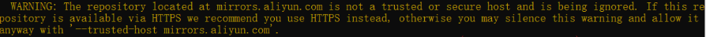

- [1. pip](#1-pip)
  - [1.1. 换源](#11-换源)
    - [1.1.1. 永久修改](#111-永久修改)
      - [1.1.1.1. pip自动](#1111-pip自动)
      - [1.1.1.2. 手动](#1112-手动)
    - [1.1.2. 临时换源](#112-临时换源)
  - [1.2. 命令](#12-命令)
    - [1.2.1. 常用](#121-常用)
    - [1.2.2. 离线包](#122-离线包)
    - [1.2.3. git包](#123-git包)

---

# 1. pip
## 1.1. 换源


### 1.1.1. 永久修改


这是全局效果，系统python、conda的base环境python、conda自创环境下的python都读取同一个配置文件`~/.config/pip/pip.conf`。


#### 1.1.1.1. pip自动
linux和win都通用。

- 设置

新版ubuntu要求使用https源，要注意。
```bash
# 北外（最快）
url1='https://mirrors.bfsu.edu.cn/pypi/web/simple'
url2='https://mirrors.bfsu.edu.cn'

# 中国科技大学	
url1='https://pypi.mirrors.ustc.edu.cn/simple'
url2='https://pypi.mirrors.ustc.edu.cn'

# 清华(有点限速)
url1='https://pypi.tuna.tsinghua.edu.cn/simple'
url2='https://pypi.tuna.tsinghua.edu.cn'

# 阿里云(十分限速)	
url1='https://mirrors.aliyun.com/pypi/simple'
url2='mirrors.aliyun.com'
```
```bash
pip config set global.index-url $url1
pip config set install.trusted-host $url2
```
修改别的源的话直接再打一遍就会覆盖掉。
- 查看效果
```bash
$ pip config list
global.index-url='https://mirrors.bfsu.edu.cn/pypi/web/simple'
install.trusted-host='https://mirrors.bfsu.edu.cn'
```
- 删除
```bash
$ pip config unset global.index-url 
Writing to ~/.config/pip/pip.conf

# 就少了[global]的index-url
$ cat ~/.config/pip/pip.conf
[install]
trusted-host = https://mirrors.bfsu.edu.cn

# 再删install的trusted-host
$ pip config unset install.trusted-host
```
#### 1.1.1.2. 手动

内容如下：
```
$ vim ~/.config/pip/pip.conf
[global]
index-url = https://pypi.tuna.tsinghua.edu.cn/simple

[install]
trusted-host = https://pypi.tuna.tsinghua.edu.cn
```

> Linux下

修改文件`~/.config/pip/pip.conf`


> windows下

修改文件`C:/Users/Admin/AppData/Roaming/pip/pip.ini`


### 1.1.2. 临时换源

可以在使用pip的时候加参数`-i https://mirrors.aliyun.com/pypi/simple/ --trusted-host mirrors.aliyun.com`，其中`-i`(`--index-url`)表示换源，`--trusted-host`表示信任源。不然会有warning，



例如：
```bash
$ pip install pyspider -i $url1 --trusted-host $url2
```
## 1.2. 命令

### 1.2.1. 常用
```bash
# 打印到控制台
$ pip list
```
```bash
# 更新包
# -U, --upgrade
pip install -U MODULE

# 更新pip
pip install -U pip
```
```bash
pip install SomePackage            # latest version
pip install SomePackage==1.0.4     # specific version
pip install 'SomePackage>=1.0.4'   # minimum version
```
```bash
# 输出到文件中
$ pip freeze > requirements.txt

# 安装文件中的包列表
# -r, --requirement <file>
$ pip install -r requirement.txt
```

### 1.2.2. 离线包

```bash
pip install xxx.whl
```

### 1.2.3. git包

```bash  
pip install -e git+https://github.com/openai/CLIP.git@main#egg=clip
```
- 会在当前目录下创建`src/clip`。也就是说，会下载到`src`文件夹中（所以不要用`src`作为代码文件夹）。`clip`是根据`#egg=clip`得到的。`#egg=clip` 这个随便起，报错会告诉你真正叫做什么名字。
- `-e`会当前项目安装到python环境中，会使用`src/clip/setup.py`来安装`clip`包。

PS：
1. 这种没有`.git`的，实在下载不下来。废弃！
```bash
pip install -e git+https://github.com/openai/CLIP@main#egg=clip
```

2. 其实上面的命令就是下面命令的组合。
```bash
git clone https://github.com/openai/CLIP.git
cd src/clip
python setup.py install
```