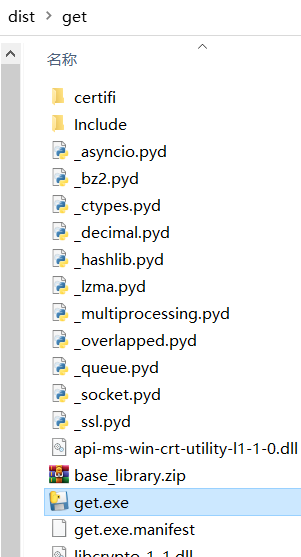
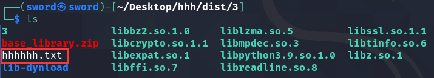
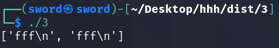
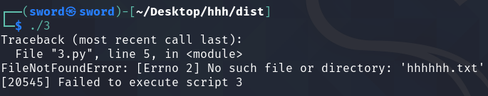
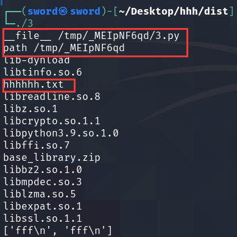
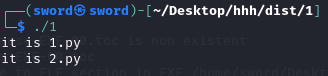

[toc]

---

[[toc]]

---

- [1. pyinstaller](#1-pyinstaller)
  - [1.1. Intro](#11-intro)
  - [1.2. 打包配置](#12-打包配置)
    - [1.2.1. 控制台](#121-控制台)
    - [1.2.2. spec规范文文件](#122-spec规范文文件)
  - [1.3. 常用参数](#13-常用参数)
    - [1.3.1. One-Folder模式和One-File模式](#131-one-folder模式和one-file模式)
    - [1.3.2. 调出控制台窗口与否](#132-调出控制台窗口与否)
    - [1.3.3. 资源文件](#133-资源文件)
  - [1.4. 其他](#14-其他)
    - [1.4.1. execute多个文件](#141-execute多个文件)
    - [1.4.2. 自定义模块的no module问题](#142-自定义模块的no-module问题)
    - [1.4.3. python库no module的问题](#143-python库no-module的问题)
    - [1.4.4. 调试](#144-调试)

---


# 1. pyinstaller
## 1.1. Intro

- 第三方库，要自己安装，安装到虚拟环境中。

    ```python
    pip install pyinstaller
    ```

- You distribute the program to other people, and they can execute your program. To your users, the app is self-contained. 
  
  - They do not need to install any particular version of Python or any modules. 
  
  - They do not need to have Python installed at all.
  
  - Some file in your project, e.g. txt, wav, img.
  
  - But command application depends on OS are not suitable, e.g.`subprocess.run('ffmpeg -i a.mp4 b.mp4')`, if you want to use ffmpeg on Windows, you should manully download and install it so that python application can correctly run.

- win、linux、mac
  
    如果你是windows，想要打包出mac的应用的程序。是开个macOS的虚拟机，复制代码和建立虚拟环境，在虚拟机中打包出来。

    ```bash
    win$ pip freeze > requirements.txt
    mac$ conda create --name q python=3.9 -y
    mac$ conda activate q
    mac$ pip install -r requirements.txt
    mac$ pip install pyinstaller
    mac$ pyinstaller main.py
    ```


- 资料
  
    官网资料：<https://pyinstaller.readthedocs.io/en/stable/requirements.html>
    
    详细参数说明：<https://pyinstaller.readthedocs.io/en/stable/usage.html>

## 1.2. 打包配置
### 1.2.1. 控制台
> 控制台中：`pyinstaller [options] script`
```bash
pyinstaller -F -w my_script.py 
```
> 把控制台中的命令写成python文件让其执行，到时候`python 文件.py`。
```python
import PyInstaller.__main__

PyInstaller.__main__.run([
    'my_script.py',
    '--onefile',
    '--windowed'
])
```
### 1.2.2. spec规范文文件
将控制台中的命令写成规范文文件，到时候

```bash
pyinstaller [options] 规范文文件.spec
```

PS：从规范文件构建时，命令行中options指定的参数会和规范文件内指定的参数起冲突：
- 大部分将被忽略，参数只按照规范文件中的选项配置。
- 只有以下命令行的参数起作用：`--upx-dir=`，`--distpath=`，`--workpath=`，`--noconfirm`，`--ascii`，`--clean`（▲）。


## 1.3. 常用参数

|参数 options|作用|
|:-|:-|
|`-h`,`--help`|显示帮助|
|`-v`, `--version`|显示程序版本信息|
|`-n NAME`, `--name NAME`|命名生成的应用程序（默认值：第一个脚本的名称）|
|`-D`, `--onedir`|One-Folder模式（默认）|
|`-F`, `--onefile`|One-File模式|
|`-c`, `--console`, `--nowindowed`|【win和mac特定】调出控制台窗口（默认）。|
|`-w`, `--windowed`, `--noconsole`|【win和mac特定】不调出控制台窗口，即静默模式。|
|`-i <FILE.ico or FILE.exe,ID or FILE.icns or “NONE”>`, <br>`--icon <FILE.ico or FILE.exe,ID or FILE.icns or “NONE”>`| 【win和mac特定】<br>①FILE.ico：将该图标应用于Windows可执行文件。<br>②FILE.exe，ID，从exe中提取ID为ID的图标。<br>③FILE.icns：将图标应用于Mac OS X上的.app捆绑包。<br>④使用“ NONE”不应用任何图标，从而使操作系统显示某些默认设置。<br>⑤默认（不写这个参数时）：用PyInstaller的图标|
|`-p DIR`, `--paths DIR`|A path to search for imports. Multiple paths are allowed, separated by ':', or use this option multiple times.|
|`--add-data <SRC;DEST or SRC:DEST>`|win下用`;`分隔，是前者；linux下用`:`分隔，是后者。<br>SRC是文件打包前所在路径，DEST是在打包程序中的目录。<br>一般是txt、图片、pdf、配置文件之类的.This option can be used multiple times.|
|`--add-binary <SRC;DEST or SRC:DEST>`|一般是dll、so|
|`--clean`|清理 PyInstaller cache，在构建之前删除临时文件|


### 1.3.1. One-Folder模式和One-File模式

打包`get.py`，产生三个文件（夹）：
- `get.spec`：用于pyinstaller打包的规格文件。不用关心。
- `build`：如同大多数编译器一样的构建过程文件夹。不用关心。
- `dist`：结果产物，你关心的。

>One-Folder模式：
```python
# -D 默认
pyinstaller get.py
```
这就是那种发过来一个zip文件夹，你解压一下运行其中exe的程序。
正如解压，把这个get文件夹压缩成zip，给别人就行。
单独把exe移出文件夹运行，失败。




>One-File模式：
```python
pyinstaller -F get.py
```
本质是把那么多文件都整合到了exe中，运行时再解压出来。
运行的时候会解压到临时文件夹，所以运行时启动会因为这个原因慢几秒，之后运行就和One-Floder一样快。

### 1.3.2. 调出控制台窗口与否
- 如`print()`之类的I/O信息会输出到控制台窗口上。
- 你有GUI的图形化界面，比如Pyqt，自然不需要控制台窗口。
- PS: `-w`可以反过来当作静默模式。哪怕我们不主动打印`print`，程序也会跳出一个控制台，我们可以用来`-w`让它连控制台都跳不出来。

### 1.3.3. 资源文件

```

```

```bash
pyinstaller --add-data ./hhhhhh.txt:. 3.py
pyinstaller --add-data ./hhhhhh.txt:. 3.py
```


> One-Folder


```python
# 3.py
   
import os,sys

with open('hhhhhh.txt', 'r') as fp:
    print(fp.readlines())
```
```bash
pyinstaller --add-data ./hhhhhh.txt:. 3.py
```



因为确实存在于目录下，所以直接就能获取


> One-File



因为One-File中是解压到临时文件夹中下，而不是当前文件夹下，自然找不到。

所以解决办法就是：使用绝对路径=临时文件夹目录+相对路径。

```python
# 3.py

from os import path
# 主文件解压后的绝对路径
print('__file__=',__file__)
# 主文件解压后所在目录的绝对路径
parentPath = path.dirname(__file__)
print('parentPath=',parentPath)

toolPath = path.dirname(path.join(parentPath,'.'))
print('toolPath=',toolPath)

# 打印看一下path下的各文件、文件夹情况
from os import listdir
for _ in listdir(path):          
    print(_)

# 绝对路径+相对路径
with open(path.join(toolPath,'hhhhhh.txt'),'r') as fp:
    print(fp.readlines())
```
```bash
pyinstaller --add-data ./hhhhhh.txt:.  3.py   
```


```bash
pyinstaller --add-data='checkpoint:checkpoint' main.py
```

## 1.4. 其他
### 1.4.1. execute多个文件

```bash
# 这样表示你顺序执行多个py文件
pyinstaller [options] script1 script2 …
```
```python
# 1.py
if __name__ == "__main__":
    print('it is 1.py')
```
```python
# 2.py
if __name__ == "__main__":
    print('it is 2.py')
```
```python
pyinstaller 1.py 2.py
```


打包出来都是以其为主程序来执行。`a.py`和`b.py`谁先谁后，只关乎打包文件的名字采用第一个文件，谁先运行罢了。
所以写模块文件的时候，不要在模块文件中写`if __name__ == "__main__":`的测试部分。

### 1.4.2. 自定义模块的no module问题

首先推荐[相对路径中的main-module架构](../路径/相对路径.md)。

其次，如果`sys.path`的写法来调用模块`b.py`，pyinstaller就找不到，你得加入`pyinstaller -p=/path/to/module`模块的目录名。

### 1.4.3. python库no module的问题

pyinstaller并不是支持所有的库的. for example, 
- by using the `__import__()` function with variable data, 
- using `importlib.import_module()`, 
- or manipulating the `sys.path` value at run time. 
- 小众的库
- 打包了，但没有完全打包，比如`pyside6`打包后没有打包`QtMultimedia`

所以要手动打包进去（使用`One-Fold`模式），把`miniconda\envs\d2l\Lib\site-packages\PySide6`复制到`dist/appName`下。


### 1.4.4. 调试

直接打开exe文件报错会一闪退出。如果想看程序报错，先打开终端，在输入exe文件的路径即可。

```bash
dist/appName$ ./appName.exe
```