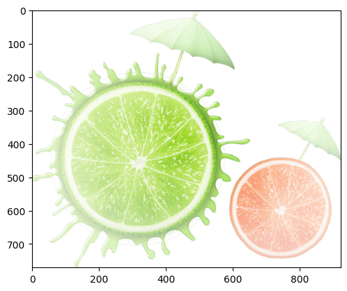

---

## install

```python
pip install imageio
```
## read，show, write
```python
import imageio.v3 as iio
import matplotlib.pyplot as plt

# 读入
img = iio.imread('imageio:chelsea.png')

# 显示图片: 直接对uint8的[0, 255]、float64的[0, 255]/255.0的都行
plt.imshow(img)

# 保存图片: uint8的可以直接保存, float64的[0, 255]/255.0需要转化为uint8后才能保存
iio.imwrite('uint8.jpg', img)
iio.imwrite('float64_0to1.jpg', (img * 255).astype(np.uint8))
```
  
## shape
```python
# [H, W, C]，HW对应行列, 数组样式，C对应RGBA
img.shape
```
