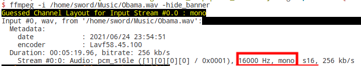
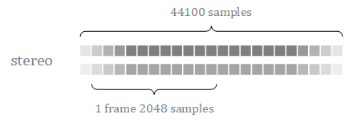

- [1. 主要三个信息](#1-主要三个信息)
- [2. 其他信息](#2-其他信息)

---
## 1. 主要三个信息

  

通过ffmpeg告诉我们采样率是16khz，单声道。

- **采样率 sample_rate**

  每秒音频数据的采样数（以赫兹为单位）。

  正常人听觉的频率范围大约在20Hz~20kHz之间，根据奈奎斯特采样理论，为了保证声音不失真，采样频率应该在40kHz左右。
  
  常用的音频采样频率有8kHz, 11.025kHz, 22.05kHz, **16kHz** , 37.8kHz, 44.1kHz, 48kHz等。

- **采样格式 sample_format / 采样宽度 sample_width**

  一个采样的大小。

  通常，8bit（1字节），16bit（2个字节），32bit（4个字节）

- **通道数 n_channels**

  声道数，1（单声道, mono）或2（双声道, stereo）。

> 公式

- 音频时长 = 音频总采样数 / 采样频率
  n_seconds = n_samples / sample_rate

- 音频大小 = 音频总采样数 * 采样宽度 * 通道数
  n_bytes = n_samples * sample_width * n_channels = len(data)

## 2. 其他信息

  

- **块 block/buffer**
  一帧包含通道数 n_channels 个样本（一帧是所有通道，每个通道有一个采样）。即一帧的字节数 = 一个采样的字节数 * 通道数
  samples_per_frame（一帧内会包含一个或者多个块，一个块由多个样本组成 CHUNK）
  一帧记录了一个声音单元，它的大小是样本长度 sample_width 和声道数 n_channels 的乘积。
