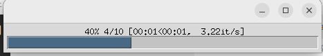
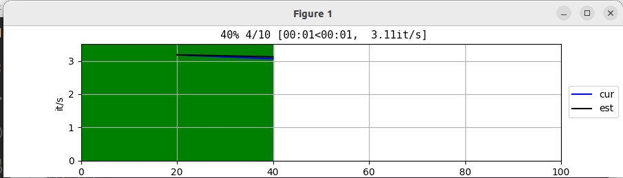

- [1. progressbar](#1-progressbar)
  - [1.1. Install](#11-install)
  - [1.2. Basic](#12-basic)
    - [1.2.1. iterable](#121-iterable)
    - [1.2.2. total](#122-total)
    - [1.2.3. write](#123-write)
  - [1.3. Advance](#13-advance)
    - [1.3.1. 前缀](#131-前缀)
    - [1.3.2. 后缀](#132-后缀)
    - [1.3.3. 颜色](#133-颜色)
    - [1.3.4. 单位](#134-单位)
    - [1.3.5. 数字换算](#135-数字换算)
    - [1.3.6. 起点](#136-起点)
  - [1.4. Other Environment](#14-other-environment)

# 1. progressbar
<https://tqdm.github.io/docs/tqdm/>
## 1.1. Install

```bash
pip install tdqm
```
```python
from tqdm import tqdm
```

## 1.2. Basic

### 1.2.1. iterable
> 手动关闭
```python
l1 = list(range(5))

# tdqm(a iterable object, not iterator)
pbar1 = tqdm(l1)
for i in pbar1:
    # print(i) , 迭代的东西还是可以用的
    sleep(0.5)
pbar1.close()

'''
100%|██████████| 5/5 [00:00<00:00, 92385.55it/s]
'''
```

> with自动关闭
```python
with tqdm(range(5)) as pbar2:
    for i in pbar2:
        # print(i)
        sleep(0.5)
```

PS: `pbar1 = tqdm(l1)`和`pbar2 = tqdm(l2)`要是写在一起, 那么第二个进度条就不会显示出来. 所以创建`pbar2 = tqdm(l2)`要写在`pbar1.close()`后面.
```python
pbar1 = tqdm(range(5))
# pbar2 = tqdm(range(5)) # 不该写在这里

for i in pbar1:
    sleep(0.5)
pbar1.close()

pbar2 = tqdm(range(5))
for i in pbar2:
    sleep(0.5)
```

### 1.2.2. total

```python
# 一共10个
with tqdm(total=10) as pbar:
    for i in range(10):
        pbar.update(1)  # 每次更新1个
        sleep(0.1)
```
### 1.2.3. write

有时候 `print` 输出会跟在进度条的后面，半天找不到。

`tqdm.write()`来替代，不过`tqdm.write(i)`不行，需要 `str`

```python
(method) def write(
    s: str,
    file: SupportsWrite[str] | None = None,
    end: str = "\n",
    nolock: bool = False
) -> None
```

```python
for i in pbar1:
    # print(i)
    tqdm.write(f"{i}")
```

## 1.3. Advance
### 1.3.1. 前缀
> 这种方式用于没有动态内容的前缀
```python
with tqdm(range(3),desc='Prefix') as pbar5:
    for i in pbar5:
        sleep(0.25)
'''
Prefix: 100%|██████████| 3/3 [00:00<00:00,  3.99it/s]
'''
```
> 这种方式用于有动态内容的前缀
```python
with tqdm(range(3)) as pbar6:
    for i in pbar6:
        # 动态展示当前运行到的 i
        pbar6.set_description(f'Dynamic Prefix-{i}')
        sleep(0.25)

'''
Dynamic Prefix-1:  33%|███▎      | 1/3 [00:00<00:00,  2.32it/s]
Dynamic Prefix-2: 100%|██████████| 3/3 [00:00<00:00,  3.98it/s]
'''
```

### 1.3.2. 后缀

```python
pbar1 = tqdm(range(5))

for i in pbar1:
    pbar1.set_postfix(KEY='VALUE', a_num = 1, a_bool= False, a_list=[1,2])
    sleep(0.1)
'''
100%|██████████| 10/10 [00:01<00:00,  9.90it/s, KEY=VALUE, a_bool=0, a_list=[1, 2], a_num=1]
'''
```

### 1.3.3. 颜色

```python
with tqdm(range(3), colour='#00ff00') as pbar5:
    for i in pbar5:
        sleep(0.25)
```

### 1.3.4. 单位

描述处理项目的文字, 默认是'it', 例如: 100 it/s, 处理照片的话设置为'img' ,则为 100 img/s, 下载时设为'B'.

```python
pbar2 = tqdm(range(5), unit="单位")
for i in pbar2:
    sleep(0.5)

'''
100%|██████████| 5/5 [00:02<00:00,  1.99单位/s]
'''
```

### 1.3.5. 数字换算
自动根据国际标准进行项目处理速度的换算, 例如 100000 it/s >> 100k it/s
```python
total_size = 123456
l1 = list(range(total_size))
with tqdm(total=total_size, unit_scale=True) as pbar:
    for i in l1:
        pbar.update(1000)
        sleep(0.1)

'''
unit_scale默认False: 
32%|███▏      | 40000/123456 [00:03<00:08, 10142.84it/s]

unit_scale=True: 
59%|█████▉    | 73.0k/123k [00:07<00:05, 10.1kit/s]
'''
```

### 1.3.6. 起点

```python
l1 = list(range(100))
pbar1 = tqdm(l1, initial=30)
for i in pbar1:
    sleep(0.5)
pbar1.close()
```
已运行的时间还是从0开始，剩余时间也没问题。
## 1.4. Other Environment

```python
# the above is tqdm.std
from tqdm import tqdm, trange
```

```python
# jupyter notebook
from tqdm.notebook import tqdm, trange
```

```python
# 自动选择合适的引入，根据顺序
# - tqdm.autonotebook: Automatically choose between tqdm.notebook and tqdm.std
# - tqdm.asyncio
# - tqdm.std
from tqdm.auto import trange, tqdm
```


图形化界面：

```python
from tqdm.tk import tqdm, trange
```
  

```python
from tqdm.gui import tqdm, trange
```
  
