- [1. 知识](#1-知识)
- [2. 多线程](#2-多线程)
  - [2.1. 停止flag](#21-停止flag)
  - [2.2. 守护线程](#22-守护线程)
  - [2.3. join让主进程等待](#23-join让主进程等待)
  - [2.4. 内容](#24-内容)
  - [2.5. 生产者消费者](#25-生产者消费者)
  - [2.6. 锁](#26-锁)
- [3. 线程池](#3-线程池)
- [4. 多进程](#4-多进程)
- [5. 协程](#5-协程)
- [6. 信号量](#6-信号量)

---

## 1. 知识


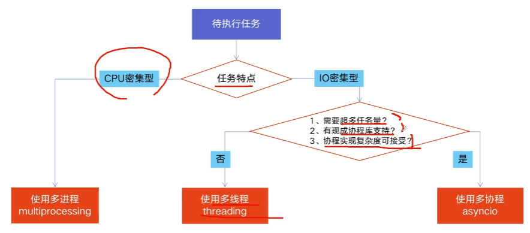

全局解释器锁GIL

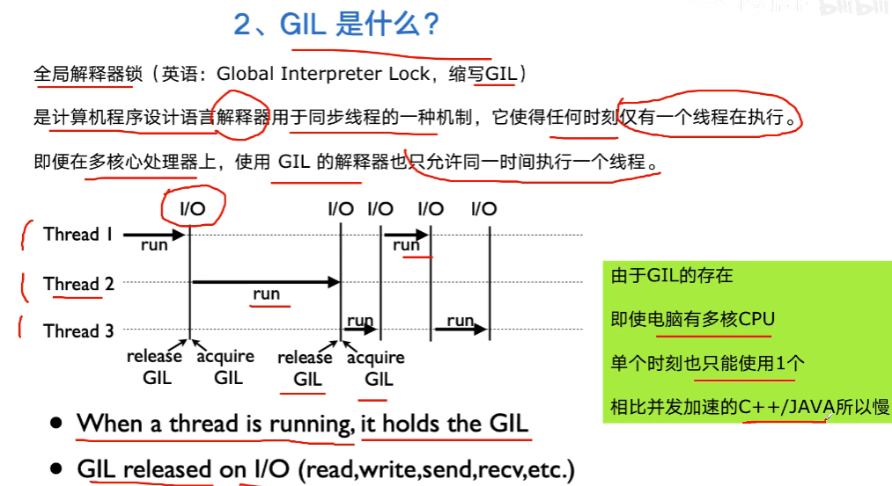

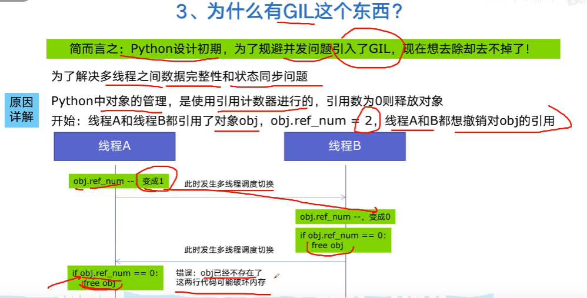

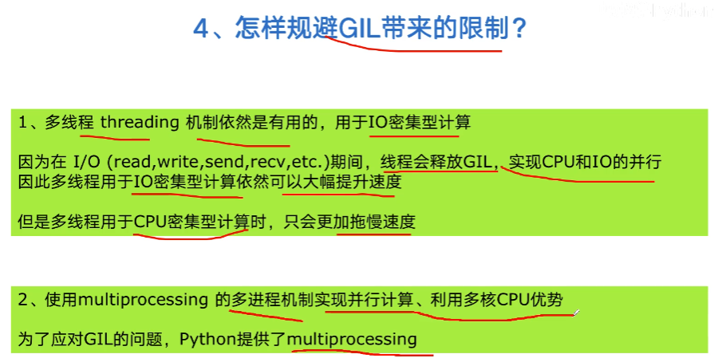


## 2. 多线程
- `threading.Thread(target, name, args, daemon, ...)`
- `threading.active_count()`
- `threading.current_thread()`
- `threading.enumerate()`
  
Instance:
- `.join()`
- `.start()`
- `.setDaemon()`
- `.is_alive()`

### 2.1. 停止flag


一种 stop_threads 变量的方式
```python
import threading 
import time 

def run(): 
    while True: 
        time.sleep(0.1)
        print('thread running') 
        if stop_threads: 
            break

stop_threads = False
t1 = threading.Thread(target=run) 
t1.start() 
time.sleep(1) 
stop_threads = True
t1.join() 
print('thread killed') 
'''
thread running
thread running
thread running
thread running
thread running
thread running
thread running
thread running
thread running
thread running
thread killed
'''


# -------------------------

import threading 
import time 

class Dog():
    def __init__(self):
        self.stop_threads = False
        t1 = threading.Thread(target=self.run)
        t1.start() 
        time.sleep(1) 
        self.stop_threads = True
        t1.join() 
        print('thread killed') 
        pass

    def run(self): 
        while True: 
            print('thread running') 
            if self.stop_threads: 
                break

dog = Dog()
```
一种让 stop_threads 变成函数的方式
```python
import threading 
import time 


def run(stop_threads): 
    while True: 
        print('thread running') 
        if stop_threads(): 
            break

stop_threads = False

# args 只有一个参数时，必须有逗号，不然不是 tuple
t1 = threading.Thread(target=run, args=(lambda: stop_threads,)) 
t1.start() 
time.sleep(1) 
stop_threads = True
t1.join() 
print('thread killed') 


# -----------------------
# 写成类

import threading 
import time 

def run(stop_threads): 
    while True: 
        print('thread running') 
        if stop_threads(): 
            break

class Dog():
    def __init__(self):
        self.stop_threads = False
        t1 = threading.Thread(target=run, args=(lambda: self.stop_threads,)) 
        t1.start() 
        time.sleep(1) 
        self.stop_threads = True
        t1.join() 
        print('thread killed') 
        pass

dog = Dog()

# ---------------------
# 成员函数

import threading 
import time 


class Dog():
    def __init__(self):
        self.stop_threads = False
        t1 = threading.Thread(target=self.run, args=(lambda: self.stop_threads,)) 
        t1.start() 
        time.sleep(1) 
        self.stop_threads = True
        t1.join() 
        print('thread killed') 
        pass

    def run(self, stop_threads): 
        while True: 
            print('thread running') 
            if stop_threads(): 
                break

dog = Dog()
```

### 2.2. 守护线程

设置`daemon=True`(默认False)会标记其为守护线程。

- 当主进程已经结束后，如果剩下的线程只有守护线程时，守护进程直接退出。
- 当主进程没有结束，那么剩下的线程只有守护线程时，守护进程也不会退出。


比如，我有两个线程，一个read线程一直在print消息，另一个write线程则在input。我们想设置一个退出信号`q`，让write线程退出后，read线程也跟着退出。

```python
import threading
import time


def read():
	i=0
	while True:
		print(i)
		i += 1
		time.sleep(1)

def write():
	while True:
		s = input()
		if s=='q':
			break

if __name__ == '__main__':
    print('test begin...')
    
    tw=threading.Thread(target=write)
    tr=threading.Thread(target=read, daemon=True)
    tw.start()
    tr.start()
	
    for i in range(5):
        print('main', i)
        time.sleep(1)
		
'''
# main的5秒后输入q，则主线程已经退出，write线程一退出，read线程立马退出。
(nerf) PS D:\git\gpuhot> & D:/Applications/miniconda/envs/nerf/python.exe d:/git/gpuhot/src/gpuhot/1.py
test begin...
0
main 0
1
main 1
2
main 2
3
main 3
main 4
4
5
6
q7

# main的5秒内输入q，则write线程退出，但主线程还没退出，read线程就仍在跑。
# 当过了5秒，主线程退出后，read线程立马退出。
(nerf) PS D:\git\gpuhot> & D:/Applications/miniconda/envs/nerf/python.exe d:/git/gpuhot/src/gpuhot/1.py
test begin...
0
main 0
1
main 1
q
2
main 2
main 3
3
main 4
4
'''
```

### 2.3. join让主进程等待


```python
'''
等待子线程结束后，主线程才继续输出 `'world'`.
'''
import threading
import time

def print666():
    time.sleep(5)
    print('666')

if __name__ == '__main__':

    t = threading.Thread(target=print666)
    t.start()
    
    print('hello')
    t.join();
    print('world')
'''
hello
666
world
'''
```

```python
'''
陷入死循环。因为主线程在等read结束，而read守护线程只有当主线程结束才自动退出。
'''
import threading
import time


def read():
	i=0
	while True:
		print(i)
		i+=1
		time.sleep(1)

def write():
	while True:
		s=input()
		if s=='q':
			break

if __name__ == '__main__':
    print('test begin...')
    
    tw=threading.Thread(target=write)
    tr=threading.Thread(target=read, daemon=True)
    tw.start()
    tr.start()
	
    tr.join()
    print('main')
```

### 2.4. 内容

列表、对象、字典都是可以保存的
```python
'''
列表
'''
import threading
import time


def get_i_lists(i, i_lists):
    i_lists.append(i)
    time.sleep(5)
    pass

if __name__ == "__main__":
    threads = []
    i_lists = []
    for i in range(10):
        t = threading.Thread(target=get_i_lists, args=(i, i_lists))
        threads.append(t)

    for t in threads:
        t.setDaemon(True)
        t.start()

    print("hello")

    for t in threads:
        t.join()

    print("world")

    for i in i_lists:
        print(i)
'''
hello
world
0
1
2
3
4
5
6
7
8
9
'''
```

### 2.5. 生产者消费者
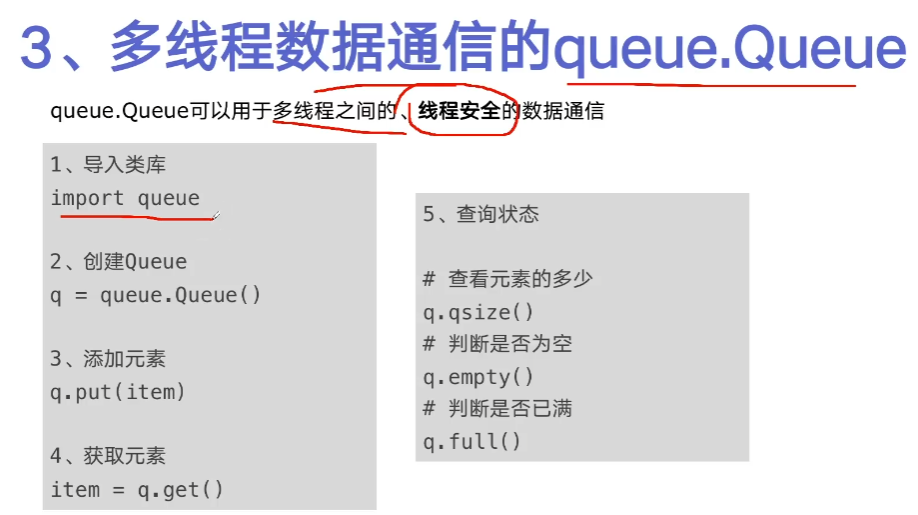


```python
import queue
import threading
import time

from numpy import mat


def produce(material_queue: queue.Queue, product_queue: queue.Queue):
    while material_queue.qsize() > 0:
        materail = material_queue.get()
        time.sleep(1)
        product_queue.put(materail + " producted")
        print(
            f"name = {threading.current_thread().name}, product_queue's size = {product_queue.qsize()}"
        )


def consume(product_queue: queue.Queue):
    while True:
        product = product_queue.get()
        time.sleep(1)
        print(
            f"name = {threading.current_thread().name}, product_queue's size = {product_queue.qsize()}"
        )


material_queue = queue.Queue()
for i in range(10):
    material_queue.put("material" + str(i))
product_queue = queue.Queue()

# 几个生产者
for i in range(3):
    producer = threading.Thread(target=produce, args=(material_queue, product_queue))
    producer.start()

# 几个消费者
for i in range(2):
    consumer = threading.Thread(target=consume, args=(product_queue,))
    consumer.start()

'''
name = Thread-2 (produce), product_queue's size = 1
name = Thread-3 (produce), product_queue's size = 2
name = Thread-1 (produce), product_queue's size = 2
name = Thread-2 (produce), product_queue's size = 2
name = Thread-3 (produce), product_queue's size = 3
name = Thread-5 (consume), product_queue's size = 4
name = Thread-1 (produce), product_queue's size = 4
name = Thread-4 (consume), product_queue's size = 4
name = Thread-2 (produce), product_queue's size = 3
name = Thread-5 (consume), product_queue's size = 3
name = Thread-4 (consume), product_queue's size = 4
name = Thread-1 (produce), product_queue's size = 4
name = Thread-3 (produce), product_queue's size = 5
name = Thread-5 (consume), product_queue's size = 3
name = Thread-4 (consume), product_queue's size = 3
name = Thread-2 (produce), product_queue's size = 4
name = Thread-5 (consume), product_queue's size = 2
name = Thread-4 (consume), product_queue's size = 2
name = Thread-5 (consume), product_queue's size = 0
name = Thread-4 (consume), product_queue's size = 0
'''
```
### 2.6. 锁 
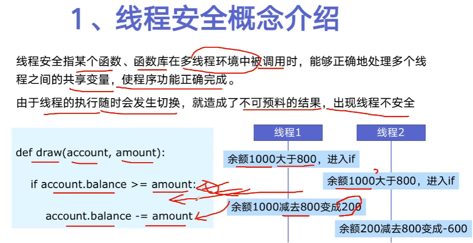

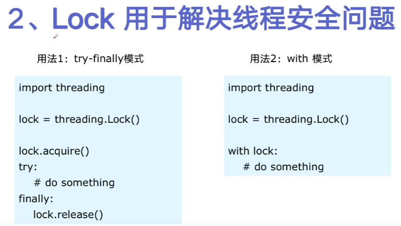

```python
'''
没有带锁
'''
import threading 
import time
from attr import dataclass 

@dataclass
class Accout:
    balance: int = 1000


def run(accout: Accout, amount: int): 
    # 只有这里的sleep，不出问题
    # time.sleep(0.1) 
    if accout.balance >= amount:
        # 这里的sleep（耗时操作），就会出问题。因为多个线程都已经通过了if判断，然后都进入了这里，然后都sleep了，然后都减了钱
        time.sleep(0.1)
        accout.balance -= amount
        print(f"balance = {accout.balance}")
    else:
        print("not enough money")

accout = Accout()
for i in range(2):
    t = threading.Thread(target=run, args=(accout, 800))
    t.start()
'''
balance = 200
balance = -600
'''
```

```python
import threading 
import time
from attr import dataclass 


@dataclass
class Accout:
    balance: int = 1000


def run(accout: Accout, amount: int): 
    with lock:
        if accout.balance >= amount:
            time.sleep(0.1)
            accout.balance -= amount
            print(f"balance = {accout.balance}")
        else:
            print("not enough money")

lock = threading.Lock()
accout = Accout()
for i in range(2):
    t = threading.Thread(target=run, args=(accout, 800))
    t.start()
'''
balance = 200
not enough money
'''
```
## 3. 线程池

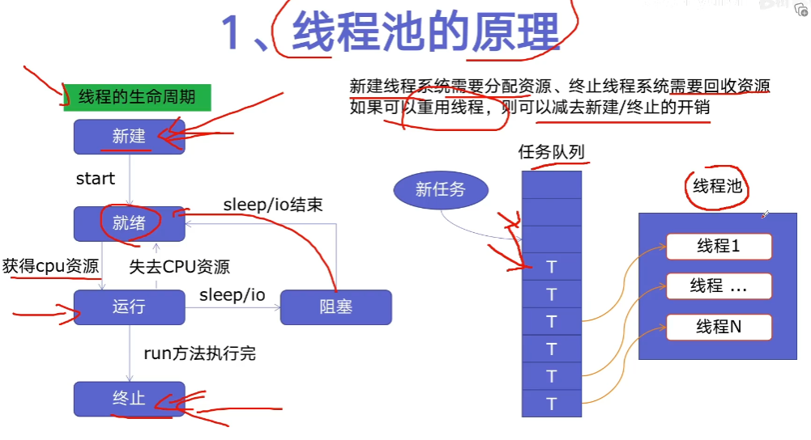

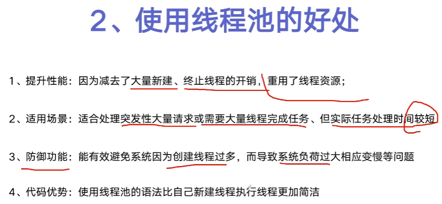

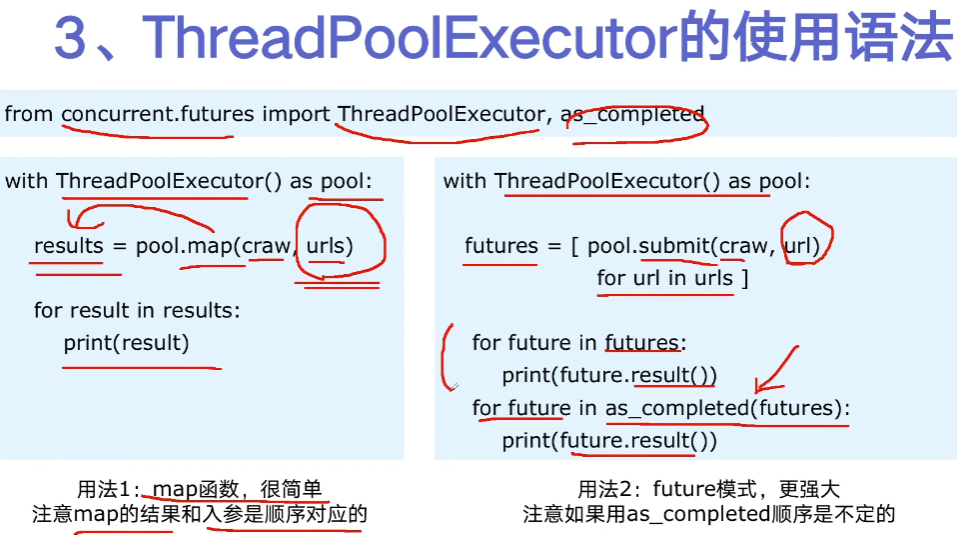

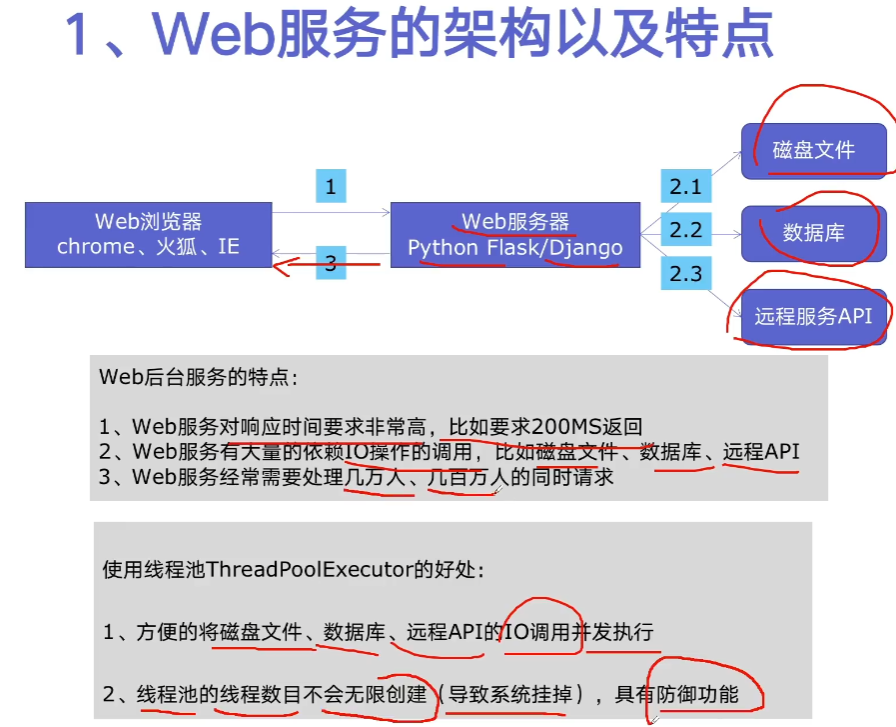

- 要么直接提交一个列表，要么依次提交单个元素。
- 要么按列表的提交顺序返回（需要都执行完）；要么按谁先完成的顺序返回（不需要都执行完了）。

```python
'''
线程池
'''
import time
import concurrent.futures
import threading

sleep_time = [ 5, 1, 3, 2, 4, 5, 1, 2, 3, 4 ]

def run(i):
    r = sleep_time[i]
    time.sleep(r)
    print(f"thread {i} start, sleep {r} seconds")
    return i

i_list = [ i for i in range(10) ]

with concurrent.futures.ThreadPoolExecutor() as executor:
    results = executor.map(run, i_list)
    for result in results:
        print(result)
    print('-'*20)
    

with concurrent.futures.ThreadPoolExecutor() as executor:
    futures = []
    for i in range(10):
        future = executor.submit(run, i)
        futures.append(future)

    for future in futures:
        print(future.result())
    print('-'*20)


with concurrent.futures.ThreadPoolExecutor() as executor:
    futures = []
    for i in range(10):
        future = executor.submit(run, i)
        futures.append(future)
    # 按谁先完成的顺序重新组织
    futures = concurrent.futures.as_completed(futures)
    for future in futures:
        print(future.result())
'''
thread 1 start, sleep 1 seconds
thread 6 start, sleep 1 seconds
thread 7 start, sleep 2 seconds
thread 3 start, sleep 2 seconds
thread 2 start, sleep 3 seconds
thread 8 start, sleep 3 seconds
thread 9 start, sleep 4 seconds
thread 4 start, sleep 4 seconds
thread 5 start, sleep 5 seconds
thread 0 start, sleep 5 seconds
0
1
2
3
4
5
6
7
8
9
--------------------
thread 6 start, sleep 1 seconds
thread 1 start, sleep 1 seconds
thread 7 start, sleep 2 seconds
thread 3 start, sleep 2 seconds
thread 2 start, sleep 3 seconds
thread 8 start, sleep 3 seconds
thread 4 start, sleep 4 seconds
thread 9 start, sleep 4 seconds
thread 0 start, sleep 5 seconds
thread 5 start, sleep 5 seconds
0
1
2
3
4
5
6
7
8
9
--------------------
thread 6 start, sleep 1 seconds
thread 1 start, sleep 1 seconds
6
1
thread 3 start, sleep 2 seconds
thread 7 start, sleep 2 seconds
3
7
thread 2 start, sleep 3 seconds
thread 8 start, sleep 3 seconds
2
8
thread 9 start, sleep 4 seconds
thread 4 start, sleep 4 seconds
9
4
thread 0 start, sleep 5 seconds
thread 5 start, sleep 5 seconds
0
5
'''
```

## 4. 多进程
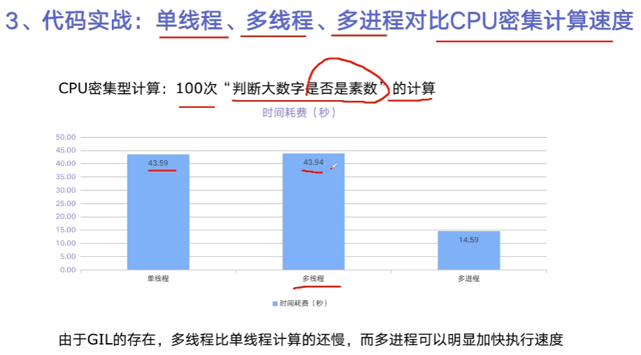

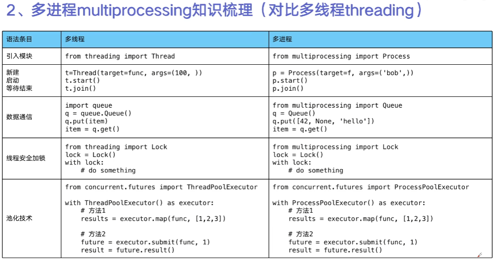

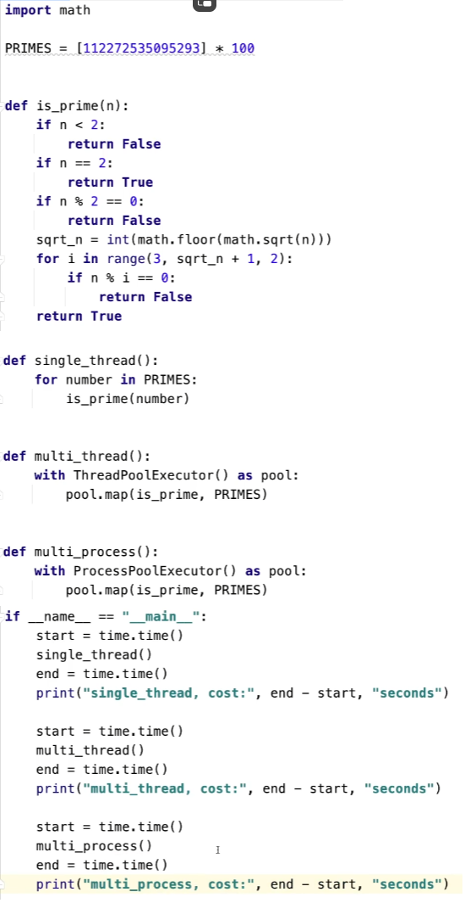

## 5. 协程

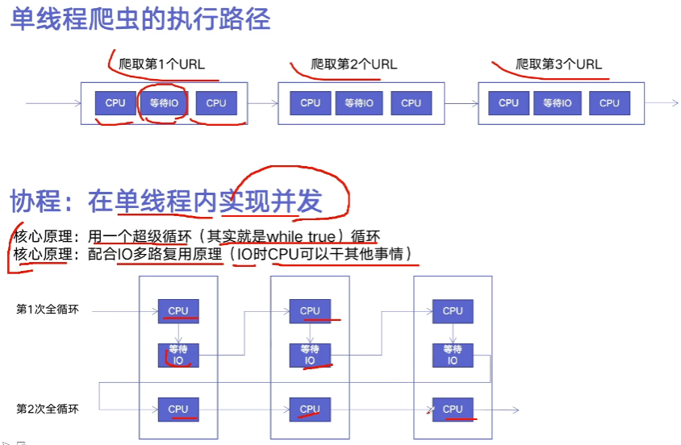

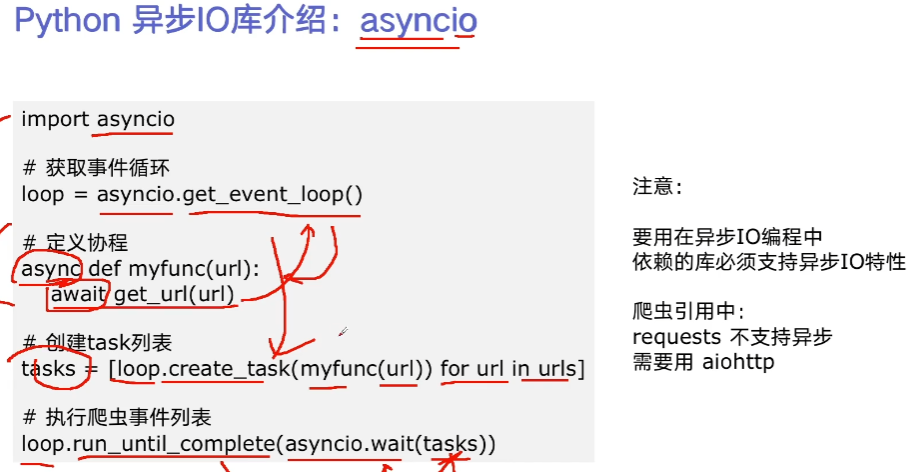

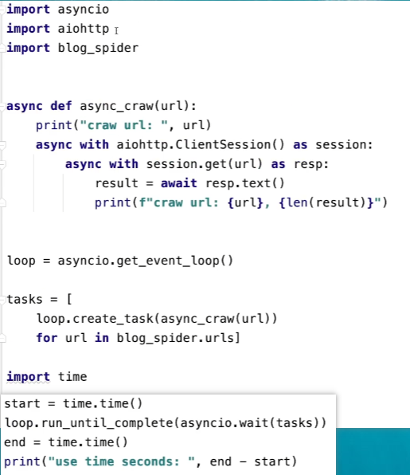

## 6. 信号量

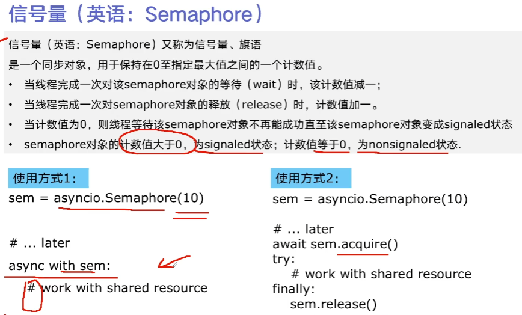

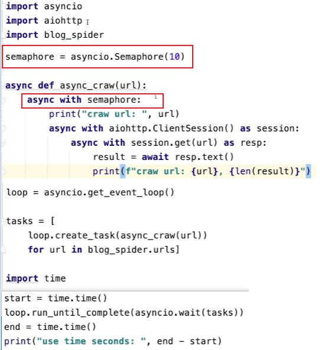