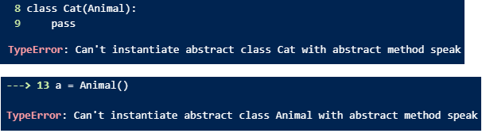

- [1. super()初始化](#1-super初始化)
- [2. 抽象类](#2-抽象类)


---
## 1. super()初始化

```python
class Animal():
    def __init__(self) -> None:
        print('animal init')
class Cat(Animal):
    pass

c = Cat()
# animal init

class Person():
    def __init__(self, name) -> None:
        print(f'name: {name}')
class Student(Person):
    pass

p = Student('kitty')
# name: kitty
```
如果子类的初始化函数和父类的没什么区别，那么可以不用显式地写`super().__init__()`或者``super().__init__(*args)``

```python
class Person:
    def __init__(self, person_name, person_age):
        self.name = person_name
        self.age = person_age

class Student(Person):
    def __init__(self, student_name, student_age, student_id):
        super().__init__(self, student_name, student_age)
        self.studentId = student_id
```

python 3 的 syntax 更简洁的等同替换：
- 父类：
  - `class Person:`
  - `class Person():`
- 子类：
  - `super().__init__(student_name, student_age)`，在Python 3中，你可以省略父类的名字和self参数，因为Python会自动推断它们
  - `Person.__init__(self, student_name, student_age)`

python 2 的 syntax 等同替换（python3兼容python2的，反之不行）：
- 父类：
    `class Person(object):`，任何类都必须继承`object`
- 子类：
    `super(Student, self).__init__(student_name, student_age)`，必须指明父类。

## 2. 抽象类

> 可以使用抽象类，可以不实现抽象类的方法

```python
class animal():
    def speak(self):
        pass
class cat(animal):
    def say_hello(self):
        print("hello")
a=animal()    
c=cat()
c.say_hello()
c.speak()
```

> 不让实例化抽象类，`@abstractmethod`的抽象方法必须实现

  

```python
from abc import ABC,abstractmethod
class Animal(ABC):
    def say_hello(self):
        print("hello")
    @abstractmethod
    def speak(self):
        pass
class Cat(Animal):
    def speak(self):
        print("speak")
        pass

c = Cat()
c.speak()
c.say_hello()
```

类方法或静态方法, 则应分别使用 `@abstractclassmethod` 和 `@abstractstaticmethod`


另外，直接继承`ABC`也等同于指定元类`metaclass=ABCMeta`:
```python
from abc import ABCMeta,abstractmethod
class Animal(metaclass=ABCMeta):
    def say_hello(self):
        print("hello")
    @abstractmethod
    def speak(self):
        pass
```